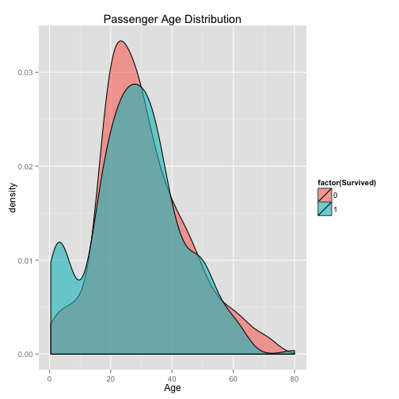
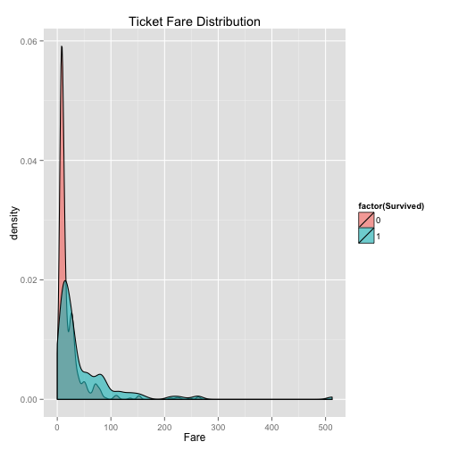
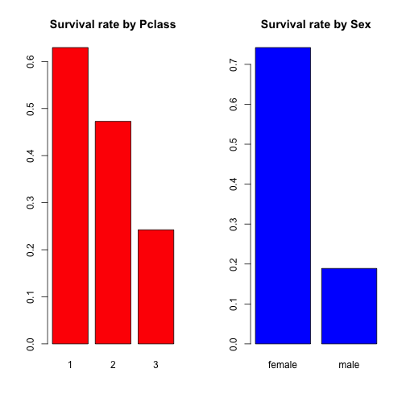
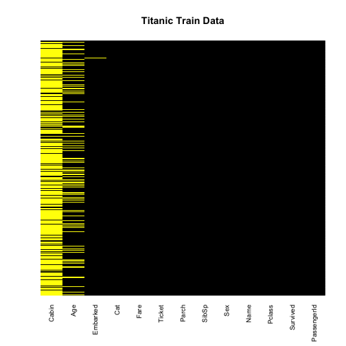
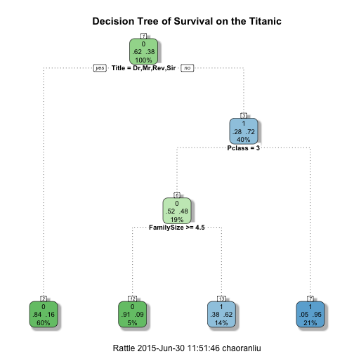

         
##Ojectives:
Given some incompleted passenger information:   
1. Find out what sorts of people were likely to survive.  
2. Predict which passengers survived the tragedy.   

##Description of Data:                                  
**Survival: **     Survival (0 = No; 1 = Yes)                      
**Pclass: **      Passenger Class   (1 = 1st; 2 = 2nd; 3 = 3rd)     
**Name: **        Name                                            
**Sex: **        Sex                                             
**Age: **        Age                                                                    
**Sibsp: **     Number of Siblings/Spouses Aboard               
**Parch: **       Number of Parents/Children Aboard               
**Ticket: **     Ticket Number                                   
**Fare: **       Passenger Fare                                  
**Cabin: **      Cabin                                           
**Embarked: **    Port of Embarkation                             
   


```r
summary(train)
```

```
##   PassengerId       Survived          Pclass          Name          
##  Min.   :  1.0   Min.   :0.0000   Min.   :1.000   Length:891        
##  1st Qu.:223.5   1st Qu.:0.0000   1st Qu.:2.000   Class :character  
##  Median :446.0   Median :0.0000   Median :3.000   Mode  :character  
##  Mean   :446.0   Mean   :0.3838   Mean   :2.309                     
##  3rd Qu.:668.5   3rd Qu.:1.0000   3rd Qu.:3.000                     
##  Max.   :891.0   Max.   :1.0000   Max.   :3.000                     
##                                                                     
##      Sex                 Age            SibSp           Parch       
##  Length:891         Min.   : 0.42   Min.   :0.000   Min.   :0.0000  
##  Class :character   1st Qu.:20.12   1st Qu.:0.000   1st Qu.:0.0000  
##  Mode  :character   Median :28.00   Median :0.000   Median :0.0000  
##                     Mean   :29.70   Mean   :0.523   Mean   :0.3816  
##                     3rd Qu.:38.00   3rd Qu.:1.000   3rd Qu.:0.0000  
##                     Max.   :80.00   Max.   :8.000   Max.   :6.0000  
##                     NA's   :177                                     
##     Ticket               Fare           Cabin             Embarked        
##  Length:891         Min.   :  0.00   Length:891         Length:891        
##  Class :character   1st Qu.:  7.91   Class :character   Class :character  
##  Mode  :character   Median : 14.45   Mode  :character   Mode  :character  
##                     Mean   : 32.20                                        
##                     3rd Qu.: 31.00                                        
##                     Max.   :512.33                                        
## 
```
   
##Intuition:
1. Female and Children are likely to have piority to board the lifeboat.   
2. Rich/Noble poeple may have some previlege.   
3. Big family may have difficulty to gather all family members to evacuate.      
   
##Approach:
1. Exploratory Data Analysis   
2. Feature Creation   
3. Deal with Incomplete Data   
4. Apply Machine Learning Models   
5. Findings   

   
##Exploratory Data Analysis:   
###1. Effect on Age   
Passenger Age distribution is close to normal distribution.   
Children (<12 years old) have bigger change to survive.   

```r
ggplot(subset(train,Age!=is.na(Age)),aes(x=Age,fill=factor(Survived)))+geom_density(alpha=0.6)+labs(title='Passenger Age Distribution')
```

 
   
###2. Effect on Fare    
Fare has a skewed distribution, majority has the Fare < $50.    
There is higher change of perishing, for those with Fare < $20.   

```r
ggplot(train,aes(x=Fare,fill=factor(Survived)))+geom_density(alpha=0.6,na.rm=TRUE)+labs(title='Ticket Fare Distribution')
```

 
   
###3. Effect on Pclass   
Higher Passenger class implies higher surival rate.   
   
###4. Effect on Sex   
Female has higher survival rate.    


```r
byPclass<-aggregate(Survived~Pclass,train,mean)
bySex<-aggregate(Survived~Sex,train,mean)
par(mfrow=c(1,2))
barplot(byPclass$Survived,names.arg=byPclass$Pclass,col='red',main='Survival rate by Pclass')
barplot(bySex$Survived,names.arg=bySex$Sex,col='blue',main='Survival rate by Sex')
```

 
   
##Binding train/test Data for Pre-Processing

```r
train$Cat<-'train'
test$Cat<-'test'
test$Survived<-NA
full<-rbind(train,test)
```
    
##Feature Creation:     
###1. Extract Title from Name    
Passenger Names are in format of Surname, Title. Firstname   

```r
full$Name[1]
```

```
## [1] "Braund, Mr. Owen Harris"
```
Split the text to get Title   

```r
full$Title<-sapply(full$Name,function(x) strsplit(x,'[.,]')[[1]][2])
full$Title<-gsub(' ','',full$Title)
table(full$Title)
```

```
## 
##        Capt         Col         Don        Dona          Dr    Jonkheer 
##           1           4           1           1           8           1 
##        Lady       Major      Master        Miss        Mlle         Mme 
##           1           2          61         260           2           1 
##          Mr         Mrs          Ms         Rev         Sir theCountess 
##         757         197           2           8           1           1
```
Aggregate some less frequent Titles      

```r
full$Title[full$Title %in% c('Capt', 'Don', 'Major','Jonkheer')] <- 'Sir'
full$Title[full$Title %in% c('Dona','the Countess' )] <- 'Lady'
full$Title[full$Title %in% c('Mlle','Mme','Ms')] <- 'Miss'
```
###2. Adding FamilySize   
FamilySie = Parch (No.of Parents/Children) + SibSp (No. of Sibling/Spouse)+1   

```r
full$FamilySize<-full$Parch+full$SibSp+1
```
###3. Adding Mother
characterize mother as female who are older than 18 years old and travelled with child    

```r
full$Mother<-0
full$Mother[full$Sex=='female' & full$Parch>0 & full$Age>18 & full$Title!='Miss']<-1
```
###4. Adding Child   
characterize child as who are not older than 12 years old    

```r
full$Child<-0
full$Child[full$Parch>0 & full$Age<=12]<-1
```
   
##Deal with Missing Data:   
###checking the missing data   

```r
library(Amelia)
missmap(train,col=c('yellow','black'),main='Titanic Train Data',legend=F,y.labels=NULL,y.at=NULL)
```

 
   
Cabin, Age, and Embarked are identified with missing values.   
   
###1. Embarked    
Only two Embarked are missing, simply assign them to the majority.   

```r
table(full$Embarked)
```

```
## 
##   C   Q   S 
## 270 123 914
```

```r
full$Embarked[is.na(full$Embarked)]<-'S'
```
   

   
###2. Age   
~30% is missing, using decision tree (regression) method to predict missing Age data

```r
library(rpart)
fit.Age<-rpart(Age~Pclass+Title+Sex+SibSp+Parch+Fare,data=subset(full,Age!=is.na(Age)),method='anova')
full$Age[is.na(full$Age)]<-predict(fit.Age,full[is.na(full$Age),])
```
   
###3. Cabin
Over 70% is missing, predicting cabin here may be inappropiate.    
Hence cabin information is ignored at this stage of analysis.   


##Split into train/test data   

```r
train<-full[full$Cat=='train',]
test<-full[full$Cat=='test',]
train$Survived<-factor(train$Survived)
#levels(train$Survived)<-c('Perished','Survived')
```
##Apply Mahcine Learning Models:   
To evaluate different models, 10 folds repeated cv is used.   
Selection metrics is accuracy.   

```r
library(caret)
control=trainControl(method='repeatedcv',number=10,repeats=10)
```
###Bayesian Logisitic Regression   

```r
set.seed(99)
fit.bl<-train(Survived~FamilySize+Pclass+Sex+Age+SibSp+Parch+Fare+Embarked+Title+Mother+Child,data=train,method='bayesglm',trControl=control,family=binomial(link='logit'))
```
###Decision Tree   

```r
set.seed(99)
fit.rp<-train(Survived~FamilySize+Pclass+Sex+Age+SibSp+Parch+Fare+Embarked+Title+Mother+Child,data=train,method='rpart',trControl=control)
```
###Random Forest   

```r
set.seed(99)
fit.rf<-train(Survived~FamilySize+Pclass+Sex+Age+SibSp+Parch+Fare+Embarked+Title+Mother+Child,data=train,method='rf',trControl=control)
```
###Neural Network   

```r
set.seed(99)
fit.nnet<-train(Survived~FamilySize+Pclass+Sex+Age+SibSp+Parch+Fare+Embarked+Title+Mother+Child,data=train,method='nnet',trControl=control,maxit=1000,trace=F,tuneGrid=grid.nnet)
```

##Compare the Prediction:   
Nerual Network is the best in terms of accuracy with 10 folds cross validation.

```r
acc.bl<-paste0(round(max(fit.bl$results$Accuracy),4)*100,'%')
acc.rp<-paste0(round(max(fit.rp$results$Accuracy),4)*100,"%")
acc.rf<-paste0(round(max(fit.rf$results$Accuracy),4)*100,"%")
acc.nnet<-paste0(round(max(fit.nnet$results$Accuracy),4)*100,'%')
```
List the accuracy for different models:   
Bayesian Logistic Regression: 82.68%   
Decision Tree: 81.22%   
Random Frost: 82.76%   
Neural Network: 82.85%   
   
##Write submission using Neural Network:   

```r
test$Survived<-predict(fit.nnet,test)
submission<-test[,1:2]
write.csv(submission,'submission.csv',row.names=F)
```
   
##Findings:   
**The most likely to survive on the Titanic are:**    
Pclass 1 & 2 female and children. (95% survived)   
**The most unlikely to survive on the Titanic are:**    
Pclass 3 female/children with family size bigger than 4. (only 9% survived)    

```r
library(rpart)
fit.rpart<-rpart(Survived~FamilySize+Pclass+Sex+Age+SibSp+Parch+Fare+Embarked+Title+Mother+Child,data=train,control=rpart.control(cp=0.01))
library(rattle)
fancyRpartPlot(fit.rpart,main='Decision Tree of Survival on the Titanic',cex=0.8)
```

 


